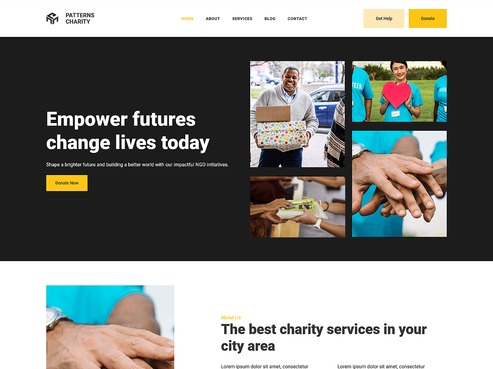

# Patterns Charity

Patterns Charity is a modern and purpose-built Full Site Editing (FSE) WordPress theme,ideal for creating a powerful online resence for charities, non-profits, and fundraising initiatives. Designed to highlight causes, donation campaigns,volunteer opportunities, and success stories, this block-based theme allows you to build a compassionate and impactful website. With its FSE features, Patterns Charity offers effortless customization of headers, footers, layouts, and global styles directly within the WordPress Site Editor.

Primary color: `#FEC415`.



## Features

- 3 hero and landing patterns
- 8 card layouts (card-1 through card-8)
- 1 service section pattern
- 5 archive/post-listing patterns
- Contact page pattern (page-contact)
- 1 menu navigation pattern
- 13 section layout patterns (featured sections and section titles)
- Full Site Editing (FSE) support
- Responsive design
- 68 block patterns + 15 templates + 11 template parts
- Charity and non-profit oriented layouts (causes, donation, volunteer)

## Requirements

- WordPress 6.6 or higher
- PHP 7.0 or higher
- Tested up to WordPress 6.7

## Development

This theme uses `@wordpress/scripts`:

```sh
npm install
npm run start    # dev mode with watch
npm run build    # production build
```

## License

GNU General Public License v2 or later.

This theme is based on [WP Block Theme Boilerplate](https://github.com/codersantosh/wp-block-theme-boilerplate), (C) 2025 Santosh Kunwar, [GPLv2 or later](https://www.gnu.org/licenses/gpl-2.0.html).
